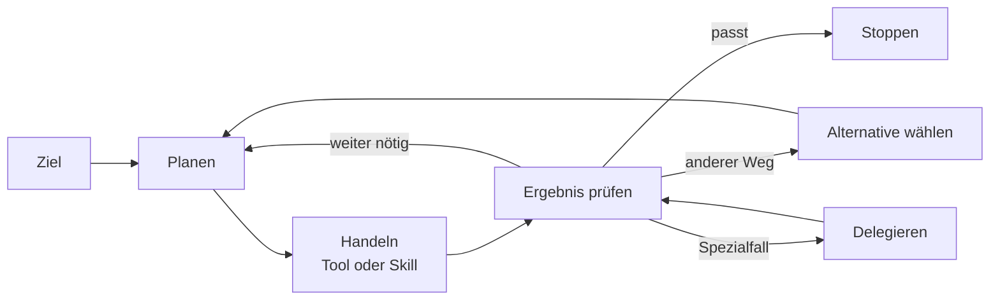

# Lab 3.1 – Agent, Skill, Agentic Loop

Ein Agent verbindet ein Ziel mit wiederverwendbaren Regeln, Wissen, Tools und Skills. Dieses Lab trennt Agent, Prompt und Chat und ordnet Nordwind-Aufgaben passend ein.

**Leitfragen:**

Was macht einen Agenten mehr als einen gespeicherten Prompt?

Ein Agent besitzt einen dauerhaften Auftrag und konfigurierbare Bausteine. Ein Prompt bleibt eine einzelne Texteingabe ohne eigene Laufzeitstruktur.

Wann Skill, wann Instruktion, wann Tool?

Instruktionen steuern das Grundverhalten, Skills kapseln wiederverwendbares Vorgehen, Tools führen Aktionen in Systemen aus.

Wann ist bewusst kein Agent sinnvoll?

Einzelfälle mit hohem Ermessen, fehlender Datenbasis oder sensibler Verantwortung bleiben beim Menschen oder bei einem einmaligen Prompt.

## Grundbegriffe

| Begriff | Bedeutung im Kurs |
| --- | --- |
| Prompt | einzelne Eingabe für eine konkrete Antwort oder einen Entwurf |
| Chat | Verlauf mit Kontext, Rückfragen und iterativer Verfeinerung |
| Agent | wiederverwendbare Konfiguration für einen wiederkehrenden Auftrag |
| Skill | `SKILL.md` mit Name, Beschreibung und Markdown-Anweisungen für eine spezialisierte Fähigkeit |
| Tool | angebundene Aktion oder Systemfunktion, z. B. Workflow, Connector oder API |

## Prompt, Chat und Agent

| Form | Gut geeignet für | Typische Grenze |
| --- | --- | --- |
| Reiner Prompt | einmalige Formulierung, Zusammenfassung, Ideenskizze | keine dauerhafte Struktur, keine Wiederverwendung |
| Chat-Agent | wiederkehrende Auskunft mit festen Regeln und Unternehmenswissen | nur so gut wie Instruktionen, Quellen und Tests |
| Agent mit Tools/Skills | mehrstufige Aufgaben, Eskalation, strukturierte Teilprozesse | braucht Governance, Pflege und klare Auslösebedingungen |
| Bewusst kein Agent | heikle Einzelfallentscheidung, fehlende Daten, persönliche Freigabe | Verantwortung darf nicht automatisiert werden |

## Vier Bausteine

| Baustein | Zweck | Nordwind-Beispiel |
| --- | --- | --- |
| Instruktionen | Rolle, Grenzen, Stil, Eskalation | „Antworte knapp, nutze nur belegte Informationen, eskaliere HR-Sonderfälle.“ |
| Wissen | fachliche Grundlage | IT-Richtlinie, Onboarding-Leitfaden |
| Tools | Aktion oder Systemzugriff | Ticket anlegen, Status prüfen, Genehmigung starten |
| Skills | wiederverwendbarer Ablauf | VPN-Zugang erklären, Onboarding-Checkliste erstellen |

## Skills als `SKILL.md`

| Element | Zweck |
| --- | --- |
| `name` | technische Kennung, lowercase-hyphen, z. B. `vpn-zugang-erklaeren` |
| `description` | knappe Zweckbeschreibung; steuert, wann der Skill passend ist |
| Markdown-Anweisungen | Ablauf, Eingaben, Prüfungen, Sonderfälle, Ausgabeformat |

Progressive Disclosure bedeutet: Der Agent lädt nur den gerade benötigten Skill-Kontext, statt alle Details dauerhaft in die Hauptinstruktionen zu schreiben.

## Agentic Loop

Das Diagramm zeigt die Schleife eines agentischen Vorgehens: Ziel verstehen, planen, handeln, Ergebnis prüfen und bewusst entscheiden.

## Nordwind-Szenario

Nordwind Consulting möchte IT- und Onboarding-Fragen entlasten. Vor dem Bauen steht die Entscheidung, welche Aufgaben wirklich einen Agenten rechtfertigen.

> **Merksatz:** Ein Agent lohnt sich erst, wenn Aufgabe, Bausteine und Verantwortung klarer sind als bei einem einzelnen Prompt.

## Häufige Fehlentscheidungen

- Ein Tool ersetzt keine fehlende Problemklärung.
- Ein Skill ist kein Datenspeicher; Quellen bleiben Knowledge oder angebundene Systeme.
- Ein Agent ohne Eskalationsregel beantwortet Grenzfälle oft zu selbstsicher.
- Der stärkste Harness ist nicht automatisch sinnvoller; Aufwand und Governance steigen mit.

## Fazit

- Agenten kombinieren Instruktionen, Wissen, Tools und Skills zu einem wiederholbaren Verhalten.
- Skills kapseln Vorgehen in `SKILL.md` und entlasten die Hauptinstruktionen.
- Der Agentic Loop macht sichtbar, wann weitergearbeitet, umgeplant, delegiert oder gestoppt wird.

Die Übung klassifiziert sechs Nordwind-Aufgaben und benennt den jeweils nötigen Baustein.
